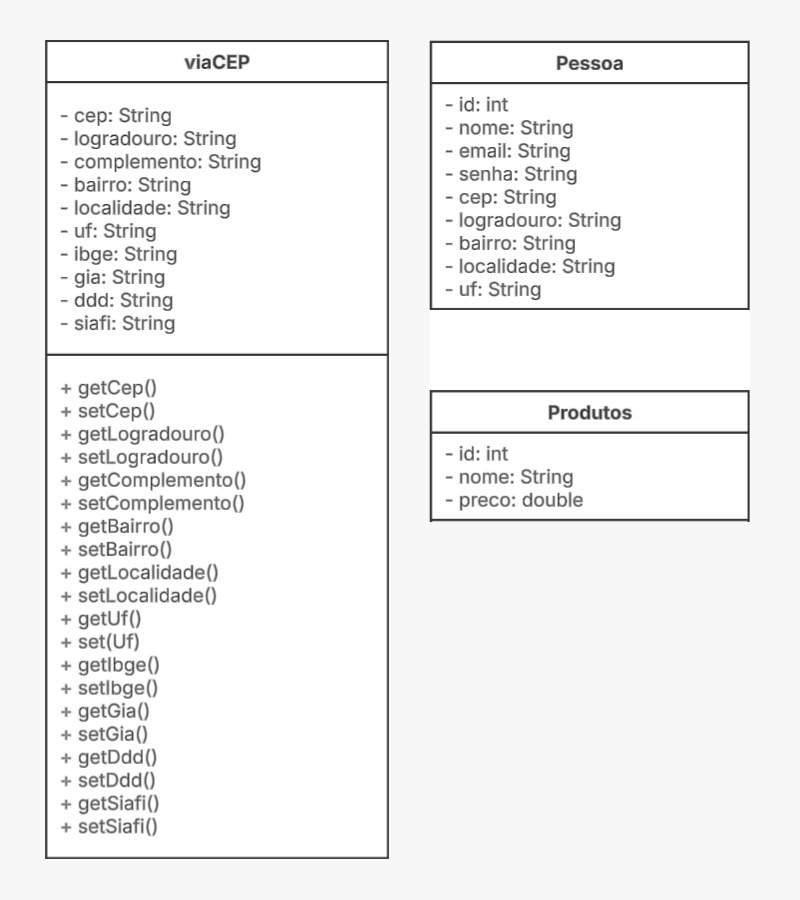
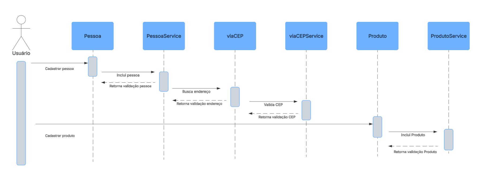

# Projeto Testes de Software — Cadastro de Usuários e Produtos
Curso: Analise e Desenvolvimento de Sistemas - Turma: 4NC

* Intergrantes:
* Felipe Nogueira Silva
* Pedro Henrique Carneichuk Rosa 
* Ranielly Evellyn Cunha
* Stefany Caroline Ferreira Sampaio

---

Este projeto faz parte da disciplina **Testes de Software**, com foco em boas práticas, automação e integração contínua.

* Aplicação **backend em Java 17 com Spring Boot 3** para cadastro de usuários e produtos.
* Exposição de API REST completa para operações CRUD (Create, Read, Update, Delete).
* Persistência de dados em PostgreSQL.
* Integração com API externa de validação (por exemplo, consulta de CEP), com gravação e reprodução de respostas via VHS (VCR Java).
* Testes automatizados cobrindo fluxos principais, exceções e integrações.

---

## Documentação UML 

# Diagrama de classe


# Diagrama de sequência do fluxo de cadastro


---

## Tecnologias e Bibliotecas

- Java 17
- Spring Boot 3
- Spring Data JPA
- Spring Web
- PostgreSQL → produção e teste
- Testcontainers → isolamento de ambiente de teste
- VHS (VCR Java) → gravação/reprodução de chamadas externas
- JUnit 5, AssertJ → testes automatizados
- Lombok → redução de boilerplate
- MapStruct → mapeamento de DTOs
- Cucumber → testes BDD

---

## Configuração do Projeto
- JDK 17+
- Maven

---

### Testando a API com PowerShell

Você consegue testar os endpoints da API usando PowerShell `Invoke-RestMethod`, url base `http://localhost:8080`:

#### Execução:
```bash
# Clonar o repositório
git clone https://github.com/FLNOG/projeto-TS.git

# Entrar na pasta do projeto
cd projeto-TS

# Compilar e executar (Maven + Spring Boot)
mvn spring-boot:run
```

## Endpoints — Pessoa:

#### POST - Cadastrar uma nova Pessoa:
```powershell
Invoke-RestMethod -Uri "http://localhost:8080/api/pessoas/cadastrar" -Method POST -ContentType "application/json" -Body '{"nome":"Joao Silva","email":"joao.silva@example.com","senha":"123456","cep":"01001000"}'
```

#### GET - Listar todas as Pessoas:
```powershell
Invoke-RestMethod -Uri "http://localhost:8080/api/pessoas/listar" -Method GET
```

#### GET - Buscar Pessoa por id:
```powershell
Invoke-RestMethod -Uri "http://localhost:8080/api/pessoas/buscar/{id}" -Method GET
```

#### PUT - Atualizar Pessoa:
```powershell
Invoke-RestMethod -Uri "http://localhost:8080/api/pessoas/atualizar/{id}" -Method PUT -ContentType "application/json" -Body '{"nome":"Joao Atualizado","email":"joao.silva@example.com","senha":"654321","cep":"01310930"}'
```

#### DELETE - Deletar Pessoa:
```powershell
Invoke-RestMethod -Uri "http://localhost:8080/api/pessoas/deletar/{id}" -Method DELETE
```

---

## Endpoints — Produto:

#### POST - Cadastrar um novo Produto:
```powershell
Invoke-RestMethod -Uri "http://localhost:8080/api/produtos/cadastrar" -Method POST -ContentType "application/json" -Body '{"nome":"Teclado Gamer","preco":299.90}'
```

#### GET - Listar todos os Produtos:
```powershell
Invoke-RestMethod -Uri "http://localhost:8080/api/produtos/listar" -Method GET
```

#### GET - Buscar Produto por id:
```powershell
Invoke-RestMethod -Uri "http://localhost:8080/api/produtos/buscar/{id}" -Method GET
```

#### PUT - Atualizar Produto:
```powershell
Invoke-RestMethod -Uri "http://localhost:8080/api/produtos/atualizar/{id}" -Method PUT -ContentType "application/json" -Body '{"nome":"Teclado Mecânico RGB","preco":349.90}'
```

#### DELETE - Deletar Produto:
```powershell
Invoke-RestMethod -Uri "http://localhost:8080/api/produtos/deletar/{id}" -Method DELETE
```

---

### Executando os Testes Automatizados:
Este projeto contém uma suíte abrangente de testes desenvolvida com JUnit 5, cobrindo regras de negócio, persistência de dados e integração com serviços externos.

A execução dos testes pode ser feita via Maven:
```bash
  mvn test
```

Ao rodar esse comando, o Maven irá:

- Compilar o código-fonte e os testes
- Executar os testes unitários e integrados
- Exibir o resumo de sucesso/falha no terminal

---